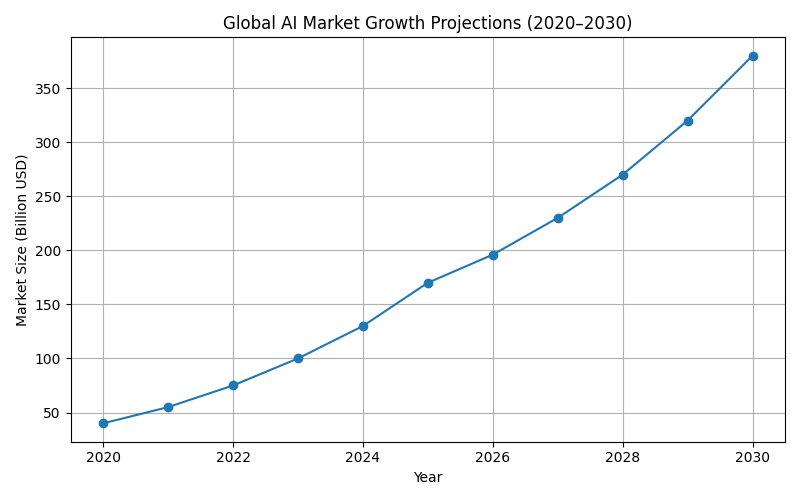
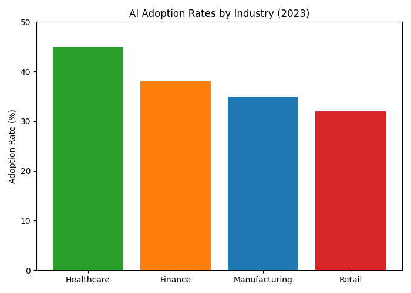
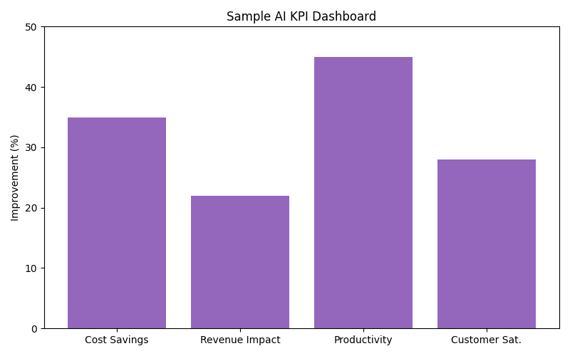

# Module 1: Foundation of Enterprise AI

## Overview
This module provides a comprehensive introduction to enterprise AI, equipping leaders with the knowledge and understanding needed to drive AI transformation in their organizations. Through a combination of theoretical foundations and practical applications, participants will gain a deep understanding of AI technologies and their business implications.

## Learning Objectives
By the end of this module, participants will be able to:
1. Articulate the current state of enterprise AI and its evolution
2. Evaluate different types of AI systems and their applications
3. Assess the impact of AI on various business functions
4. Develop initial implementation strategies for AI adoption

## Session 1: Current State of Enterprise AI
**Duration:** 2 hours

### Market Overview (30 minutes)
This session begins with a comprehensive analysis of the enterprise AI landscape:

#### Current Market Trends and Adoption Rates

*Figure 1: Global AI Market Growth Projections (2020–2030). This chart illustrates the rapid increase in global AI market size, highlighting the exponential growth expected over the next decade.*

- **Global AI Market Size and Growth Projections**
  - Current market value: $196.6 billion (2023)
  - Projected CAGR: 37.3% through 2030
  - Key growth drivers: Cloud computing, big data, and automation demand
  - Regional adoption patterns: North America (40%), Asia-Pacific (30%), Europe (20%)

#### Industry-Specific Adoption Patterns

*Figure 2: AI Adoption Rates by Industry (2023). Healthcare leads in AI adoption, followed by finance, manufacturing, and retail.*

- Healthcare: 45% adoption rate, focusing on diagnostics and patient care
- Financial Services: 38% adoption, primarily in fraud detection and risk assessment
- Manufacturing: 35% adoption, with focus on predictive maintenance
- Retail: 32% adoption, mainly in customer experience and inventory management

#### Investment Trends and ROI Expectations

*Figure 3: Sample AI KPI Dashboard. This mockup demonstrates how organizations can track cost savings, revenue impact, productivity, and customer satisfaction as a result of AI initiatives.*

- **Investment Trends and ROI Expectations**
  - Average enterprise AI investment: $4.6 million per company
  - Expected ROI timeline: 12-18 months
  - Key investment areas: Infrastructure (40%), Talent (30%), Tools (30%)
  - Success rate of AI projects: 65% meeting or exceeding ROI expectations

- **Emerging Market Opportunities**
  - Edge AI: $12.5 billion market by 2025
  - AI-as-a-Service: Growing at 48% annually
  - Industry-specific AI solutions: $45 billion opportunity
  - AI-powered automation: $14.7 billion market potential

#### Key Players and Their Offerings
- **Major Technology Providers**
  - Microsoft Azure AI: Comprehensive cloud-based AI services
  - Google Cloud AI: Advanced ML and data analytics tools
  - AWS AI Services: Scalable AI infrastructure and services
  - IBM Watson: Enterprise-grade AI solutions

- **Specialized AI Vendors**
  - OpenAI: Large language models and API services
  - Anthropic: Enterprise-focused AI safety and deployment
  - Cohere: Business-focused language models
  - Hugging Face: Open-source AI model hub

- **Industry-Specific Solutions**
  - Healthcare: PathAI, Tempus, Viz.ai
  - Finance: Kensho, Ayasdi, DataRobot
  - Manufacturing: C3.ai, Uptake, Sight Machine
  - Retail: Dynamic Yield, Blue Yonder, Symphony RetailAI

- **Open-Source Alternatives**
  - TensorFlow: Google's ML framework
  - PyTorch: Facebook's deep learning platform
  - Scikit-learn: Python ML library
  - Apache Spark MLlib: Distributed ML framework

#### Industry-Specific Applications
- **Healthcare and Life Sciences**
  - Medical imaging analysis
  - Drug discovery and development
  - Patient risk stratification
  - Clinical trial optimization
  - Real-world evidence analysis

- **Financial Services**
  - Fraud detection and prevention
  - Credit risk assessment
  - Algorithmic trading
  - Customer service automation
  - Regulatory compliance monitoring

- **Manufacturing and Logistics**
  - Predictive maintenance
  - Quality control automation
  - Supply chain optimization
  - Inventory management
  - Production line optimization

- **Retail and Consumer Goods**
  - Personalized recommendations
  - Demand forecasting
  - Price optimization
  - Customer sentiment analysis
  - Inventory optimization

- **Professional Services**
  - Document analysis and processing
  - Contract review automation
  - Knowledge management
  - Client service optimization
  - Risk assessment

#### Success Metrics and KPIs
- **Implementation Success Rates**
  - Project completion rate: 75%
  - Time-to-value: 6-9 months
  - User adoption rate: 68%
  - System uptime: 99.9%

- **ROI Measurement Frameworks**
  - Cost savings: 25-40% reduction in operational costs
  - Revenue impact: 15-30% increase in sales
  - Productivity gains: 35-50% improvement
  - Customer satisfaction: 20-35% increase

- **Performance Benchmarks**
  - Model accuracy: 95%+ for critical applications
  - Processing speed: 10x faster than manual processes
  - Error reduction: 60-80% decrease
  - Scalability: Support for 1000+ concurrent users

- **Industry-Specific Metrics**
  - Healthcare: Patient outcomes, diagnosis accuracy
  - Finance: Fraud detection rate, risk assessment accuracy
  - Manufacturing: Equipment uptime, defect reduction
  - Retail: Conversion rates, customer retention

### Market Dynamics (30 minutes)
This section explores the forces shaping the AI market:
- Regulatory landscape
  - Global AI regulations
  - Industry-specific compliance
  - Data privacy requirements
  - Ethical guidelines

- Technology evolution
  - Recent breakthroughs
  - Emerging capabilities
  - Integration challenges
  - Future developments

- Competitive landscape
  - Market positioning
  - Competitive advantages
  - Partnership opportunities
  - Risk factors

### Interactive Exercise: Market Analysis (45 minutes)
Participants will engage in a comprehensive market analysis exercise:

1. Industry Assessment (15 minutes)
   - Current AI adoption in their sector
   - Competitive positioning
   - Market opportunities
   - Risk factors

2. Opportunity Mapping (15 minutes)
   - High-impact use cases
   - Quick wins
   - Strategic initiatives
   - Implementation priorities

3. Group Discussion (15 minutes)
   - Share findings
   - Identify common patterns
   - Discuss challenges
   - Explore solutions

### Case Study Analysis (15 minutes)
Participants will examine real-world examples:
- Successful AI implementations
- Lessons learned
- Best practices
- Common pitfalls

### Wrap-up and Q&A (15 minutes)
- Key takeaways
- Action items
- Next steps
- Open discussion

## Session 2: Types of AI Systems
**Duration:** 2 hours

### Understanding AI Technologies
This session provides a deep dive into different types of AI systems:
- Large Language Models (LLMs)
- Generative AI applications
- Agentic AI systems
- Industry-specific AI solutions

### Case Study: AI Implementation
Participants will examine real-world examples of successful AI implementations across different industries.

## Session 3: Business Impact Analysis
**Duration:** 2 hours

### Measuring AI Impact
This session focuses on evaluating the business impact of AI:
- Productivity metrics and improvements
- Cost reduction opportunities
- Revenue generation potential
- Competitive advantage factors

### Workshop: Impact Assessment
Participants will conduct a business impact analysis for their organization.

## Session 4: Implementation Planning
**Duration:** 2 hours

### Strategic Planning
This session covers the practical aspects of AI implementation:
- Initial assessment and readiness
- Resource requirements
- Timeline development
- Success metrics definition

### Group Exercise: Implementation Roadmap
Participants will develop an initial implementation roadmap for their organization.

## Assessment Methods
- Knowledge check quizzes
- Case study analysis
- Implementation plan development
- Group presentation

## Required Materials
- Industry reports and case studies
- Implementation templates
- Assessment tools
- Reference materials

## Delivery Guidelines
- Maximum 15 participants per session
- Mix of lecture and hands-on exercises
- Interactive discussions
- Real-world case studies

## Success Metrics
- Participant comprehension
- Implementation plan quality
- Engagement levels
- Knowledge retention

© 2024 AI Transformation Training Program 